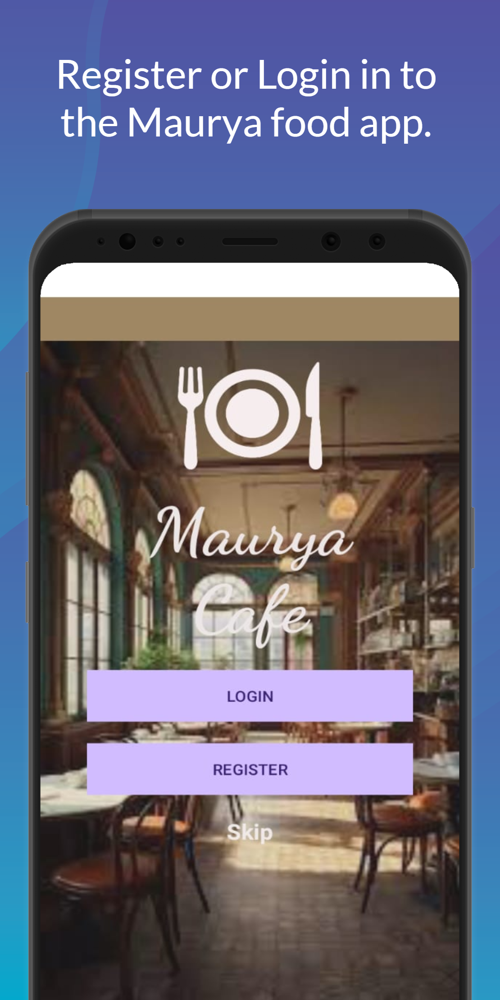
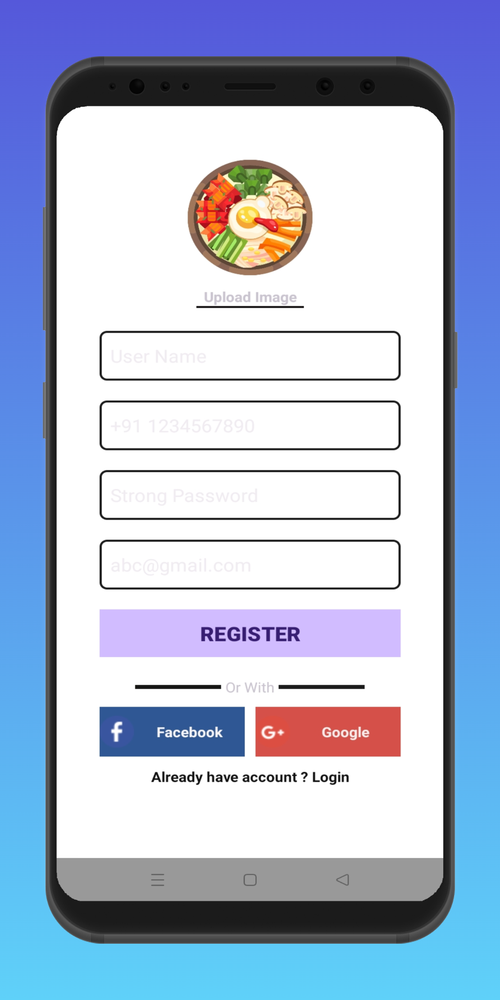
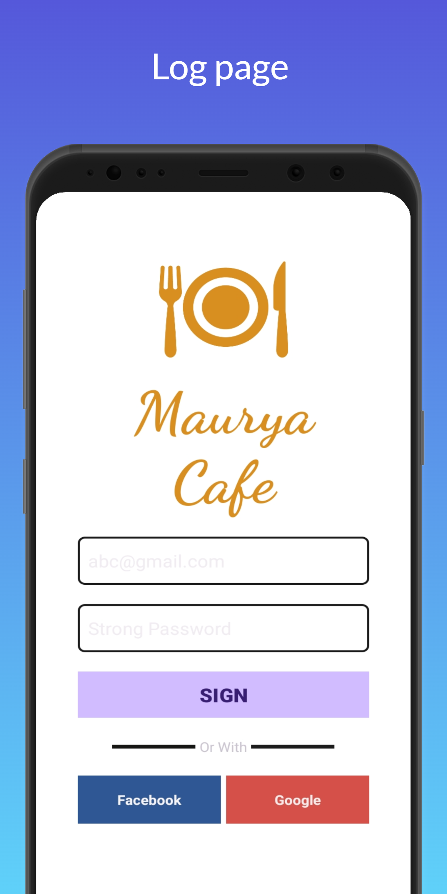
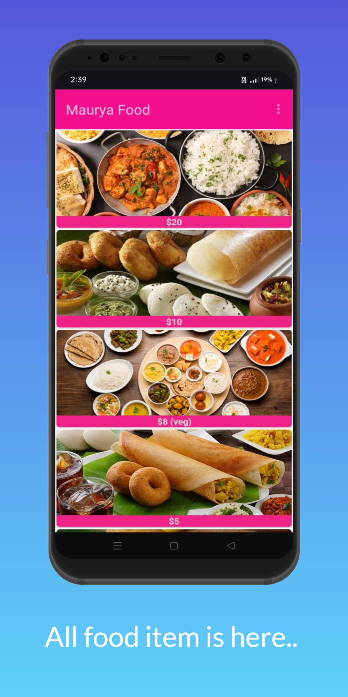

# Food Order APP

# Overview:
  A simple Food Ordering Android App (frontend).
  This app allows user to enter some details like name, mobile no, emial and register and create a password and login into the app, and inside the app, I simply used RecyclerView and show some food images. 

# Features:
- View available food items
- Sinup and Signin
- Sign up through Google and Facebook (frontend)

# Tech Stack:
- Java
- XML
- Android Studio

# ScreenShots:

  
  

  
  

# License:
- This project is for learning or educational purposes.
